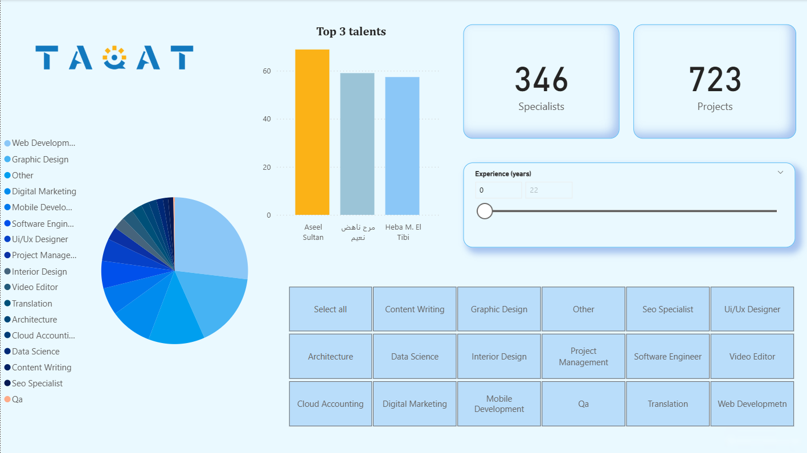

# TAQAT Talent Dashboard
Web scraping + data modeling + Power BI dashboard to support TAQAT (Gaza Works for the World) in connecting Palestinian freelancers and specialists with international recruiters.

What this project does:
  - Scrapes public talent/job data from selected sources (TAQAT-related pages and partner sites)
  
  - Cleans & standardizes skills, locations, rates, and availability
  
  - Models the data (dimensions, facts, relationships, DAX measures)
  
  - Visualizes insights in Power BI to help recruiters quickly find suitable talent

This repo underpins a presentation delivered to TAQAT and PTA Palestine to demonstrate data-driven matching between employers and freelancers.

Repository structure:

TAQAT_dashboard/
├─ Dashboard/
   ├─ dashboard_pic.png            # Dashboard pic
   └─ TAQAT.pbix                   # Power BI report
├─ Web Scraping/
   ├─ Scraping_code.ipynb          # Web scraping & cleaning workflow
   └─ taqat_all_talents.xlsx       # Scraped data
└─ README.md

📊 Dashboard pages (suggested)
Overview — active talent, categories, locations, avg rates, availability

Talent Finder — searchable by role, skills, experience, language, rate range

⚙️ Setup & usage
1) Clone the repo
  bash
  Copy code
  git clone https://github.com/sajaahmed5/TAQAT_dashboard.git
  cd TAQAT_dashboard

2) (Optional) Create a virtual environment
  bash
  Copy code
  python -m venv .venv
  source .venv/bin/activate   # Windows: .venv\Scripts\activate

3) Run the scraping
  Open Web Scraping/Scraping_code.ipynb and run all cells.

4) Open the Power BI dashboard
  Open Dashboard/TAQAT_Dashboard.pbix in Power BI Desktop
  or use this link:
  eyJrIjoiZDBjZDYxYjktNzI1NC00YjBlLWE0OGItNDViMDQ3Njk3ZGYxIiwidCI6ImE0ZTBiMmQwLWIzMDYtNGE4Ny05YTk0LTJhY2YxNTNmZWYxNiJ9

🙏 Acknowledgments
TAQAT – Gaza Works for the World initiative

PTA Palestine – feedback and evaluation

Everyone supporting Palestinian talent and remote work opportunities

Contact
Author: Saja Abdalaal

Role: Data Analyst & Trainer

Purpose: Demonstration of data-driven hiring for TAQAT
